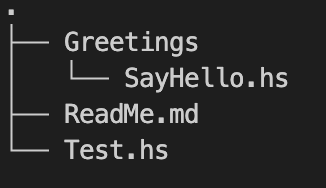
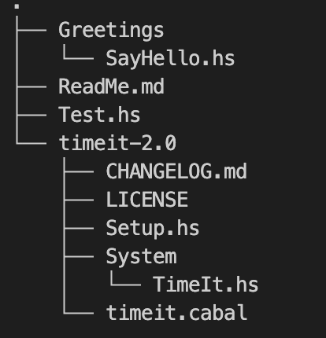

# Overview

This project is an introductory work on understanding  how to compile haskell code and how the fundemantal of the haskell packaging system works. It is part of [my overall haskell learning journey project](https://github.com/Maatary/haskell-from-first-principles).   

# Appraoch

It starts first with explaining how a simple haskell project that does not involve any external dependencies get compiled to produce an executable, and such without resorting to the use of the haskell packaging system.  

Next, in order to start explaining the fundamental of the haskell packaging system, it showcase how to compile a haskell project that use external dependencies, yet still, without resorting to the use of the  haskell packaging ststem.  

Finally, the fundementals of the haskell packaging system is explained.


# Compiling Haskell Sources With No External Dependencies to Produce an Executable Without Resorting to Packaging

Compiling the haskell sources of a project, without resorting to packaging is done as follows:

 - First we create non-package managed project a.k.a. a non-source package project. This is essentially a folder where we have our haskell source files.

    

 - Note that, as can be seen in the picture above we have a namespaced module Greetings.SayHello which follow the haskell convention expected by GHC, requiring an exact match between namespace and folder. Hence the Greetings folder and SayHello Module in it. We do this with the intent to also demonstrate/explain how during compilation ghc finds sources _(see below)_. 


 - We also intentionally name the module that contain the **main function** Test and locate it in the file Test.hs, again with the intent to explain some implicit but overlooked rules of compilation with ghc. Those rules are typically overlooked because when working with haskell packaging systems, convention are automatically applied when those tools scafold projects, hence, we just never pay attention to it. However certain projects may requires some specific setups, at that point, being aware of those rules is paramount.

 - The code is quite simple at this point

    ```haskell
     module Test where
  
        import Greetings.SayHello

        main :: IO ()
        main = sayHello "Maat"
    ```

    ```haskell
     module Greetings.SayHello where
        
        sayHello :: String -> IO ()
        sayHello x =
        putStrLn ("Hello, " ++ x ++ " and welcome to Haskell!")
    ```

 - Now we show how to compile the project without dependencies in order to produce an executable

    ```shell
     $ ghc Test.hs -main-is Test
    ```

 - Few things are happening here: 
  
   - With `ghc Test.hs` we tell GHC what source file to compile. With `-main-is Test` we tell GHC what is the Module containing the main function. 


   - GHC ccompile the code into an inteface file **`Test.hi`** and library object file **`Test.o`** and then link it with whatever package/library already present in GHC that the program might use _(the base library in this instance as we use System.IO)_, into an executable file **Test**. We can run the executable as follows:
        ```shell
        $ ./Test
        Hello, Maat and welcome to Haskell!
        ```
  
   - Typically the convention is to call the module containing the **main function** **Main**, and the containing file as per haskell module rules **Main.hs**. If done according to the convention we could have simply type
        ```shell
        $ ghc Main.hs 
        ``` 

   - However for the **Main module** **the rule for "module" / "source file" strict name correspondance** are actually relaxed. So we could have had the file called **Test.hs** and the module inside it **Main** and then type
        ```shell
        $ ghc Test.hs 
        ```

   - Moreover we could have simply ommit the **Main** module inside the **Test.hs** and type the same as above. When that is the case, GHC consider that there is an implicit Main module.
        ```haskell
        import Greetings.SayHello

        main :: IO ()
        main = sayHello "Maat"
        ```


   - It is important to note if none the rules on specifying the main function explicitly or implicitly as explained  above, and we simply type `ghc Test.hs` where in the **Test.hs** we have the **Test Module define** as in our current code base, then GHC would not generate an executable but simply compile the sources into the interface files and library object files.
  
   - Finally when the program contains multiple modules, such as in our codebase, then we only need to tell GHC the name of the source file containing the Main module, and GHC will examine the import declarations to find the other modules that make up the program and find their source files. This means that, with the exception of the Main module, every source file should be named after the module name that it contains (with dots replaced by directory separators). That's why Greetings.SayHello, which as per haskell namespace rules is in Greeting/SayHello can be found by GHC during compilation. For more on module hiearchy and namespace please read the main learning project which this project complement https://github.com/Maatary/haskell-from-first-principles#module-hierarchy-namespaces-and-directory-structure


   - **GHC Comilation References**
     - https://downloads.haskell.org/ghc/9.0.2/docs/html/users_guide/using.html#using-ghc
     - https://downloads.haskell.org/ghc/9.0.2/docs/html/users_guide/using.html#modes-of-operation
     - https://downloads.haskell.org/ghc/9.0.2/docs/html/users_guide/using.html#make-mode
     - https://downloads.haskell.org/ghc/9.0.2/docs/html/users_guide/phases.html?highlight=main#ghc-flag--main-is%20%E2%9F%A8thing%E2%9F%A9
     - https://stackoverflow.com/questions/46895199/no-output-will-be-generated-because-there-is-no-main-module
     - https://stackoverflow.com/questions/11112371/to-write-or-not-to-write-module-main-where-in-haskell
     - https://www.haskell.org/onlinereport/haskell2010/haskellch5.html (Abbreviated form for the module Main)
  

   - **Software Program Linkage References**
     - https://en.wikipedia.org/wiki/Linker_(computing)
     - https://en.wikipedia.org/wiki/Linkage_(software)
     - https://en.wikipedia.org/wiki/Static_library
     - https://en.wikipedia.org/wiki/Object_file
     - https://gitlab.haskell.org/ghc/ghc/-/wikis/Extensible-Interface-Files

# Compiling Haskell Sources With External Dependencies to Produce an Executable Without Resorting to Packaging

Compiling the haskell sources of a project with external dependencies, without resorting to packaging, is done as follows:

- First, from within the current project (haskell-no-project), download the depenendency manually and unpack it.

  - For this demo we will be using the **TimeIt** library which can be found on [hackage](https://hackage.haskell.org/package/timeit) or better [stackage](https://www.stackage.org/lts-19.24/package/timeit-2.0). It provides for the functionality to time functions (monadic functions).
  
  - **It is important to note at this point that, in haskell, code which represent library, are made available online as package. In other words, code intended to be used by other as distributed as package. A Package among other, play the role of a unit of distribution in Haskell.**
  
  - **Going into the detail of how package and packaging works is beyond the scope of this project, as the goal is to somewhat explain compilation without them.** However because we need to work with a dependency, such as to illustrate how to work with an external code, we had to download one, because in haskell anything that is available online is packaged. Nonetheless, as we will be illustrating further below, we will not use the haskell packaging appraoch. We will unpack it, and **"work as if"** it was just an external code that was not packaged originally. We say **"work as if"** because to speed up the all process **we will make a  minimal use of the packaging facility**, althought that is low level enough to keep being able to illustrate our point. Without it, the real process would be somewhat long and painfull. We will however provide references pointing to how to do it fully bare along the way.

  - If you would like to open the timeIT project independenly of this project, using the LHS extension for VsCode to benefit from IDE assistance while browsing the code, you have the option to use my [fork of the TimeIt project](https://github.com/Maatary/timeit) which has been adapted to work smoothly with LHS extension for VSCode. The ReadMe of the project explain the adaptation.

      ```shell
      $ curl http://hackage.haskell.org/package/timeit-2.0/timeit-2.0.tar.gz --output timeit-2.0.tar.gz                                              
      $ tar -xf timeit-2.0.tar.gz                                                
      ```

- The project tree should now look like so

   

- We then register the library as follow

   ```shell
   $ cd timeit-2.0 
   $ runhaskell Setup.hs configure 
     Configuring timeit-2.0...

   $ runhaskell Setup.hs build
     Preprocessing library for timeit-2.0..
     Building library for timeit-2.0..
     [1 of 1] Compiling System.TimeIt ( System/TimeIt.hs, dist/build/System/TimeIt.o, dist/build/System/TimeIt.dyn_o )

   $ runhaskell Setup.hs install
     Installing library in /usr/local/lib/x86_64-osx-ghc-9.0.2/timeit-2.0-13BYXbUXu2MJzbvDZuPEww
     Registering library for timeit-2.0..   
   ```
- To understand what happened let's look into the **dist** folder that has been produced has a result of running the command above.
  
  - The first take away is that `runhaskell Setup.hs build` will build the **`TimeIt.hi`** and **`TimeIt.o`** type files that we have introduced above, and link them into a static library ( i.e. **`.a`** file) together with whatever package already present in GHC that the program might use _(the base library in this instance as we use System.IO)_.  A dynamic library is also produced (i.e. **`.dylib`** file) with the equivalent **`TimeIt.dyn_hi`** and **`TimeIt.dyn_o`**
  
  - Next we can see that a file **`timeit-2.0-xxxx.conf`** was produced, which essentially provide a description of the package that is subsequently submitted to GHC when we register the library.
  
  - The **`Setup.sh`** script is essentially a **haskell program**, based on the **Cabal Library**, which is part of the defacto **haskell packaging low-level infrastructure** _(more on this later)_. Its role here* is to take a code that has been properly configured as a **_library source package_** and produce a **_library_** and **register** it in GHC. The file **_timeit.cabal_** is what make the timeit **_source package_** properly configured as a **_library source package_**. Terms like **_source package_**, **_Library source package_** or simply **_package_** will be fully explained when we dwelve into the haskell packaging system later on in this document. However, for the intent  of this section this is enough information, because stricly speaking we did not have to use the **`Setup.sh`** script.  
  This is what we meant earlier when we stated **"work as if"** in "_we will unpack it, and **"work as if"** it was just an external code that was not packaged originally_ ". That is, we are making **a minimal use** of the haskell packaging facility to register the external code. We say minimal here, because going all the way down to do it manually would be tedious as illustrated in the following reference [GHC - building a package from haskell source](https://downloads.haskell.org/ghc/9.0.2/docs/html/users_guide/packages.html?highlight=pkg#building-a-package-from-haskell-source). Moreover, if we were using the **haskell packaging system**, we would not even go trough downloading, unpacking and registering it ourself. Said differently, we would not even use the **`Setup.sh`** script. All of those, would be done automatically for us. Hence we are here focus on illustrating how compilation works with external code even if we cheat a little by using the **`Setup.sh`** script.
  
  - The **`Setup.sh`** is illustrated below
  
      ```haskell
      module Main where
      import Distribution.Simple
      main = defaultMain
      ```

  - Note that [runhaskell (or its alias runghc)](https://ghc.gitlab.haskell.org/ghc/doc/users_guide/runghc.html) is simply a **ghc command/script** that allows you to run Haskell programs without first having to compile them. It uses the internal interprer of GHC. It takes as parameter the Main module. For example, rather than  using the **Test executable** we produce earlier, we could have simply run `runhaskell Test.hs`. Here, we don't need an equivalent of `-main-is` because the command takes only the main module source file, while when we compile with GHC, the `ghc` command may take multiple source files as parameter, and therefore it needs to be told which module is the Main module.


  - References about the **`Setup.sh`** script
  
    - [Cabal Doc - Setup.hs commands]( https://cabal.readthedocs.io/en/3.6/setup-commands.html?highlight=Setup.hs#setup-hs-commands)
    - [The Haskell Package System: overview - 2.5. The Setup script](https://www.haskell.org/cabal/proposal-1.1/x122.html)


# Understanding Haskell Package From GHC perspective

